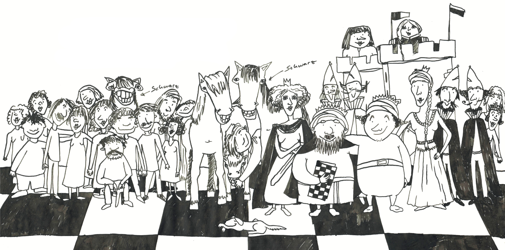

# Schach

Dokumentation Überblick

[[_TOC_]]

## Vorgehensplan

Der Vorgehensplan beinhaltet aktuelle ToDos und einen Überblick der geplanten Features.

[Vorgehensplan](documentation/Vorgehensplan.pdf)

## Anleitung

Die Anleitung beinhaltet einen einfachen Einstieg für die Verwendung unseres Programmes.

[Spielanleitung](documentation/Anleitung.pdf)

## StoryCards

Alle erstellten StoryCards zu unserem Projekt

[Storycards](documentation/Story%20Cards)

## Diagramme

Erstellte Diagramme wie UML- und Anwendungsfalldiagramm werden hier aufgelistet

[aktuelles UML-Klassen-Diagramm](documentation/uml-class-diagramm 2.png)

[aktuelles Use-Case-Diagramm](https://projects.isp.uni-luebeck.de/gruppe-10/schach/-/blob/main/documentation/Use_Case_Diagramm.PNG)

## Statische Variabeln

Identifikation der Teams:

| Team | ID |
| ---      |  ------  |
| Weiß     | 0        |
| Schwarz  | 1        |
| None     | 2        |

Identifikation der Figuren:

| Figuren | ID |
| ---       |  ------  |
| Bauer     | 1        |
| Turm      | 2        |
| Springer  | 3        |
| Läufer    | 4        |
| Dame      | 5        |
| König     | 6        |

Diese festen Zuordnungen werden von einigen teilen des Programms verwendet, um Figuren und Spieler einordnen zu können.

# Maven

Kurzübersicht nützlicher Maven-Befehle. Weitere Informationen finden sich im Tutorial:

* `mvn clean` löscht alle generierten Dateien
* `mvn compile` übersetzt den Code
* `mvn javafx:jlink` packt den gebauten Code als modulare Laufzeit-Image. Das Projekt kann danach gestartet werden mit `target/chess/bin/chess`
* `mvn test` führt die Tests aus
* `mvn compile site` baut den Code, die Dokumentation und die Tests und führt alle Tests, sowie JaCoCo und PMD inklusive CPD aus. Die Datei `target/site/index.html` bietet eine Übersicht über alle Reports.
* `mvn javafx:run` führt das Projekt aus
* `mvn javafx:run -Dargs="--no-gui"` führt das Projekt mit Command-Line-Parameter `--no-gui` aus.

