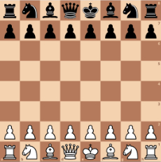

# Schach

## Board.java
### Grundlegende Funktion
Die Klasse Board kümmert sich um das eigentliche Spielfeld. Das Spielfeld besteht hier
aus einem 2D-Array vom Typ Figure. Jedes Element dieses Arrays repräsentiert ein Feld auf dem Brett.
In jedes Feld kann eine eigenständige Figur gespeichert werden. Wichtig anzumerken ist,
dass sich die Board-klasse nicht um die Richtigkeit der Figuren nach den Schachregeln kümmert,
sondern alleine fürs Abspeichern zuständig ist.

>Standard Schachaufstellung

### Konstruktor
Der Konstruktor erzeugt zu Beginn ein leeres Schachbrett. Anschließend werden für beide Teams
die jeweiligen Schachfiguren nach der Standardaufstellung auf dem Board platziert.

##Figure.java

# Maven

Kurzübersicht nützlicher Maven-Befehle. Weitere Informationen finden sich im Tutorial:

* `mvn clean` löscht alle generierten Dateien
* `mvn compile` übersetzt den Code
* `mvn javafx:jlink` packt den gebauten Code als modulare Laufzeit-Image. Das Projekt kann danach gestartet werden mit `target/chess/bin/chess`
* `mvn test` führt die Tests aus
* `mvn compile site` baut den Code, die Dokumentation und die Tests und führt alle Tests, sowie JaCoCo und PMD inklusive CPD aus. Die Datei `target/site/index.html` bietet eine Übersicht über alle Reports.
* `mvn javafx:run` führt das Projekt aus
* `mvn javafx:run -Dargs="--no-gui"` führt das Projekt mit Command-Line-Parameter `--no-gui` aus.
